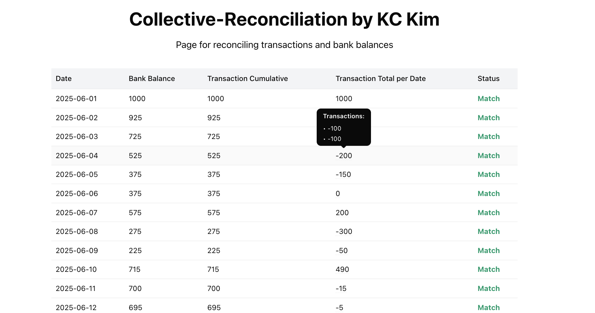

<h1>Intro</h1>
I implemented the backend using FastAPI, and it returns results in JSON format.
Due to the limited time, only the GET method is supported and the data path is currently hardcoded.

You can also use the REST Client extension to generate and test requests through a test.http file.

For the front end, I implemented using React + TypeScript with TailwindCSS + ShadCNUI

---
<h1>How to run:</h1>

1. Backend:

```
cd backend
conda create -n collective-kc python=3.11
conda activate collective-kc
pip install -r requirements.txt
uvicorn main:app --reload
```

2. Frontend:

```
cd ..
cd frontend
npm install
npm run dev
```
---
<h1>Example - Backend</h1>

```http
HTTP/1.1 200 OK
date: Tue, 04 Nov 2025 01:11:22 GMT
server: uvicorn
content-length: 2121
content-type: application/json
Connection: close

{
  "results": [
    {
      "date": "2025-06-01",
      "bank_balance": 1000.0,
      "transaction_total_per_date": 1000.0,
      "transaction_total_per_date_cumulative": 1000.0,
      "transactions_per_date": [
        1000.0
      ],
      "match_bool": true
    },
    {
      "date": "2025-06-02",
      "bank_balance": 925.0,
      "transaction_total_per_date": -75.0,
      "transaction_total_per_date_cumulative": 925.0,
      "transactions_per_date": [
        -50.0,
        -25.0
      ],
      "match_bool": true
    },
    {
      "date": "2025-06-03",
      "bank_balance": 725.0,
      "transaction_total_per_date": -200.0,
      "transaction_total_per_date_cumulative": 725.0,
      "transactions_per_date": [
        -200.0
      ],
      "match_bool": true
    },
    {
      "date": "2025-06-04",
      "bank_balance": 525.0,
      "transaction_total_per_date": -200.0,
      "transaction_total_per_date_cumulative": 525.0,
      "transactions_per_date": [
        -100.0,
        -100.0
      ],
      "match_bool": true
    },
    {
      "date": "2025-06-05",
      "bank_balance": 375.0,
      "transaction_total_per_date": -150.0,
      "transaction_total_per_date_cumulative": 375.0,
      "transactions_per_date": [
        -150.0
      ],
      "match_bool": true
    },
    {
      "date": "2025-06-06",
      "bank_balance": 375.0,
      "transaction_total_per_date": 0,
      "transaction_total_per_date_cumulative": 375.0,
      "transactions_per_date": [],
      "match_bool": true
    },
    {
      "date": "2025-06-07",
      "bank_balance": 575.0,
      "transaction_total_per_date": 200.0,
      "transaction_total_per_date_cumulative": 575.0,
      "transactions_per_date": [
        200.0
      ],
      "match_bool": true
    },
    {
      "date": "2025-06-08",
      "bank_balance": 275.0,
      "transaction_total_per_date": -300.0,
      "transaction_total_per_date_cumulative": 275.0,
      "transactions_per_date": [
        -300.0
      ],
      "match_bool": true
    },
    {
      "date": "2025-06-09",
      "bank_balance": 225.0,
      "transaction_total_per_date": -50.0,
      "transaction_total_per_date_cumulative": 225.0,
      "transactions_per_date": [
        -50.0
      ],
      "match_bool": true
    },
    {
      "date": "2025-06-10",
      "bank_balance": 715.0,
      "transaction_total_per_date": 490.0,
      "transaction_total_per_date_cumulative": 715.0,
      "transactions_per_date": [
        500.0,
        -10.0
      ],
      "match_bool": true
    },
    {
      "date": "2025-06-11",
      "bank_balance": 700.0,
      "transaction_total_per_date": -15.0,
      "transaction_total_per_date_cumulative": 700.0,
      "transactions_per_date": [
        -15.0
      ],
      "match_bool": true
    },
    {
      "date": "2025-06-12",
      "bank_balance": 695.0,
      "transaction_total_per_date": -5.0,
      "transaction_total_per_date_cumulative": 695.0,
      "transactions_per_date": [
        -5.0
      ],
      "match_bool": true
    }
  ]
}
```

---
<h1>Example - Frontend</h1>


** When you hover your mouse over a cell on "Transaction Total per Date", it will display a list of transactions for that date. **

---
